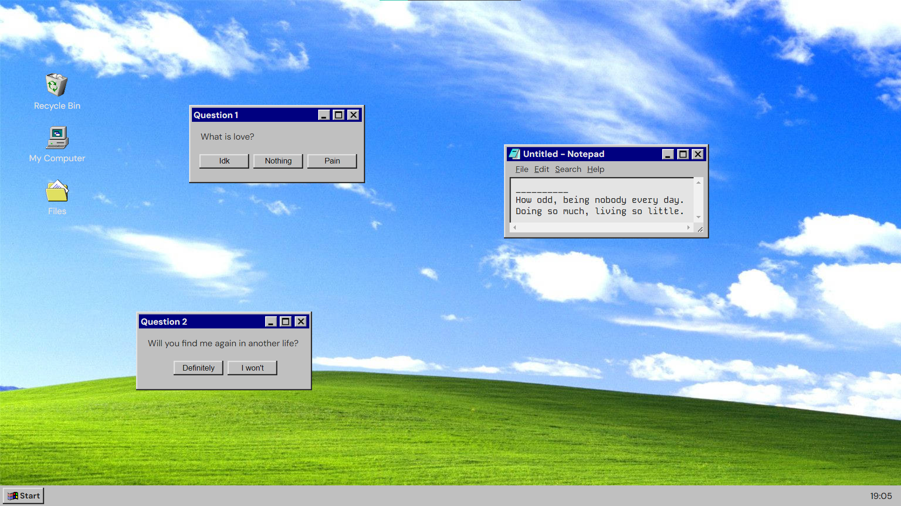

# Old Windows
 <!-- HTML -->
 <!-- CSS -->
  <!-- Javascript -->
 <!-- VSCode -->
 <!-- README -->

<br>

## 💻 Projeto

Projeto de uma página do Windows antiga, com alguns elementos arrastáveis.

<br>

Este simples projeto foi desenvolvido por mim, seguindo alguns tutoriais na internet. O intuito era a aplicação de alguns conceitos gerais de programação front-end com Javascript, como funções. O projeto ainda apresentará outras funcionalidades, como responsividade, funcionamento do menu iniciar e alguma outra aba (a ser escolhida). Estas funcionalidades ficaram para implementação futura, juntamente com o possível re-design do projeto.

<br>

### 👓 Veja você mesmo
Para ter o projeto na sua máquina local, siga este tutorial:
<br>

1. Vá até a página inicial do repositório do projeto.

2. Selecione a opção "<> Code".

3. Copie o link HTTPS do projeto.

4. Escolha um local de preferência na sua máquina e execute o Git lá dentro.

5. Clone o repositório utilizando o comando "git clone [link]":

```bash
git clone https://github.com/VitorDelabenetta/Windows-Page.git
```
6. Abra o projeto em seu ambiente de desenvolvimento para trabalhar no código ou simplesmente execute o arquivo "index.html" usando o navegador.

<br>

## Preview



<i>Imagem de preview, mostrando a página principal do projeto</i>

<br>

## 🛠 Tecnologias

Esse projeto foi desenvolvido com as seguintes ferramentas e tecnologias:

- HTML;
- CSS;
- Javascript;
- Virtual Studio Code;
- Git.
